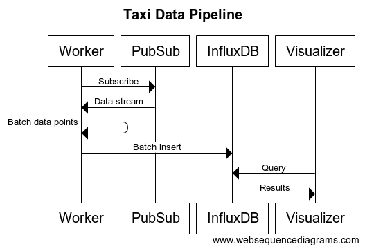

## Taxi Analytics

Above is the system design for this application. For simplicity, the 'Worker' logic and 'Visualizer' logic is handled in this same Go program.

Major decision decisions:

1. Pull-based subscription so that multiple workers can consume from the same subscription, allowing us to scale up writes. [Read more](https://cloud.google.com/pubsub/docs/pull#pubsub-pull-messages-async-go)

2. Using a time-series database (InfluxDB) for efficiency of queries since we are interested in a metric over time. [Read more](https://blog.timescale.com/what-the-heck-is-time-series-data-and-why-do-i-need-a-time-series-database-dcf3b1b18563/)

3. Batch writes so that we minimize IO overhead to the database. [Read more](https://docs.influxdata.com/influxdb/v1.7/guides/writing_data/#writing-multiple-points)

4. Separate data processing, storage, and visualizing. We may want to visualize the same data points in various ways (rides / hr, avg meter reading) or scale up these individual concerns.

Other considerations:

1. At larger scale / more complex requirements, we may want to ingest data into a pipeline of Apache Spark functions.

2. At larger scale, a single node of InfluxDB may not be sufficient for High Availability / Resilience. For that, an enterprise installation of InfluxDB will grant features for distributed mode

### Setup Minikube

1. Ensure you have minikube setup. See [here](https://kubernetes.io/docs/setup/minikube/).
2. Add helm and tiller for easier install of InfluxDB. See [here](https://helm.sh/docs/install/)

### Setup InfluxDB

1. `helm install --name v1 stable/influxdb`

2. You should be able to get the hostname of influxdb. Eg. http://v1-influxdb.default:8086

3. Create a database called `taxianalytics`

### Setup App

1. Setup your google cloud project and topic for PubSub. We will need the project id and topic name later. See [here](https://cloud.google.com/blog/products/gcp/learn-real-time-processing-with-a-new-public-data-stream-and-google-cloud-dataflow-codelab)

2. Get your your google cloud service account key and save in `<project_root>/key.json`. See [here](https://cloud.google.com/iam/docs/creating-managing-service-account-keys)

3. Set the key. `export GCLOUD_KEY=$(cat key.json)`

4. Set your google cloud project. `export TAXI_PROJECT=<gcloud_project_id>`

5. Set the PubSub topic name. `export TAXI_PROJECT=<gcloud_pubsub_topic>`

6. Set the Database host name. `export DB_HOST=<influx_db_host>`

7. Run the app. `go run main.go`

### Deploy App in Minikube

1. All the above environment variables must be setup

2. Run the deploy script using `sh deploy.sh`
